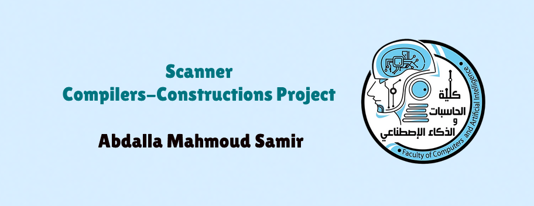

# ⚙️ Scanner


The **Scanner** project simulates the **lexical analysis stage** of a compiler. It reads source code (from file or manually), scans line by line, tokenizes the code into syntactic components, detects Arabic characters as lexical errors, and visually displays results in a colored console with line and column tracking.

> 🧠 Developed by **Abdalla Samir** at **Assiut National University**, Faculty of Computers and Artificial Intelligence  
> 📚 For the **Compilers Construction** course – 3rd Level

---

## 🚀 Features

### 🔍 Lexical Scanner
- Multi-line code scanning (manual or from file).
- Supports **reserved words**, **identifiers**, **numbers**, **strings**, **operators**, **symbols**, and **comments**.
- Tracks **line** and **column** positions for each token.

### ✅ Reserved Word Support
- Recognizes built-in **keywords** like `if`, `int`, `return`, `while`, `void`, etc.
- Flags reserved words with a distinct token type.

### 🟥 Lexical Error Detection
- Flags Arabic or non-ASCII characters as `Error`.
- Ignores unterminated strings/chars as critical errors (only Arabic causes lexical failure).
- Shows clean output: ✅ or ❌ with line/column positions.

### 🌈 Colored Console Output
- Syntax-highlighted console using `Console.ForegroundColor`.
- Different colors for identifiers, numbers, reserved words, errors, comments, and more.

### 💾 Save Token Output
- Saves scanned tokens and token summary into `tokens_output.txt`.

---

## 🚀 Getting Started

### 📦 Requirements
- [.NET SDK](https://dotnet.microsoft.com/en-us/download) (version 6.0 or higher)

### ⚙️ How to Build and Run
```bash
# Open terminal in project directory
dotnet build
dotnet run
```

---

## 💡 Example Inputs and Outputs

### Example 1:
```tiny
int x := 42;
```

**Output:**
```
[1:1-3] ReservedWord: 'int'
[1:5-5] Identifier: 'x'
[1:7-8] Assign: ':='
[1:10-11] Number: '42'
[1:12-12] Semicolon: ';'
```

### Example 2 (with Arabic):
```tiny
متغير := 5;
```

**Output:**
```
[1:1-6] Error: 'متغير'
[1:8-9] Assign: ':='
[1:11-11] Number: '5'
[1:12-12] Semicolon: ';'

❌ Lexical Errors Detected:
[Line 1, Columns 1-6] Error: 'متغير'
```

---

## 📂 Project Structure

| File/Class               | Role                                      |
|--------------------------|-------------------------------------------|
| `Program.cs`             | Main entry point                          |
| `ScannerController.cs`   | Controls input, scanning, saving          |
| `Scanner.cs`             | Core scanning logic and tokenizer         |
| `Token.cs`               | Token structure and formatting            |
| `TokenType.cs`           | All token types enum                      |
| `ReservedWordsManager.cs`| Reserved word lookup                      |
| `UserInterface.cs`       | Input/output abstraction                  |
| `TokenDisplayer.cs`      | Displays colored tokens, summaries, errors|
| `ResultSaver.cs`         | Saves tokens and summaries to a file      |

---

## 📌 Input Options

- **File input:** Paste or type a `.txt` file path.
- **Manual input:** Write code line-by-line, end with an empty line.

---

## 📁 Output

- All tokens are printed to the console.
- Token summary by type is shown.
- If enabled, saved to `tokens_output.txt`.

---

## 📚 Future Extensions

- [ ] Syntax analyzer integration  
- [ ] Semantic validation (types, scopes, etc.)  
- [ ] GUI frontend or VS Code plugin  
- [ ] Language-specific mode (e.g., TINY, Python, etc.)

---

## 🔗 Dependencies

- Standard C# libraries only
- Requires `.NET 6+` to run

---

## 🙏 Acknowledgments

- **Prof. Amal Abdelazim** – Project supervision  
- **Eng. Walid Mamdouh** – Technical guidance

---

## 📧 Contact

Let’s connect! You can reach me at:
 
[](https://www.linkedin.com/in/abdalla-samir-9264242b6/)/)  
[](mailto:samirovic707@gmail.com)  
[](https://t.me/abdallasamir04)

---

**Abdalla Mahmoud Samir**  
Faculty of Computers and Artificial Intelligence  
Assiut National University  
Compilers Construction – Third Level  
April 2025  
