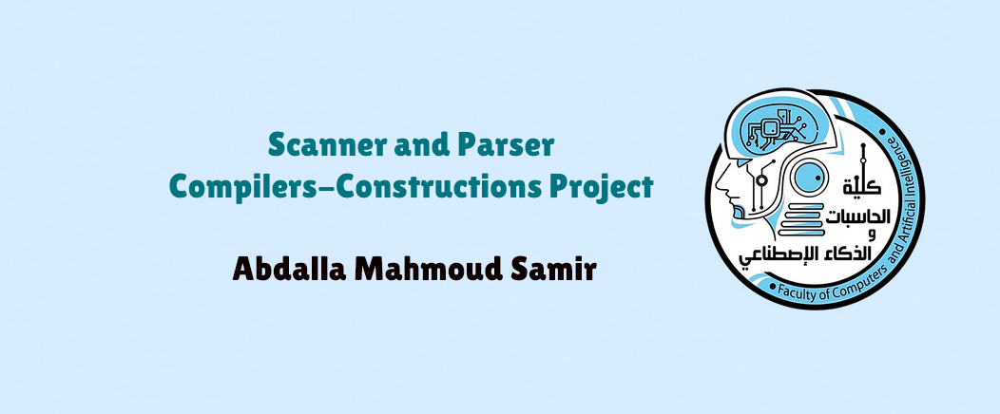

⚙️ Scanner and Parser: Compilers-Constructions Project


This project simulates the complete **Front-End** of a compiler, encompassing both the **Lexical Analysis (Scanner)** and **Syntax Analysis (Parser)** stages. It processes source code, first tokenizing it and then checking its structural correctness against a defined grammar, ultimately generating a **Parse Tree** representation.

> 🧠 Developed by **Abdalla Mahmoud Samir** at **Assiut National University**, Faculty of Computers and Artificial Intelligence
> 📚 For the **Compilers Construction** course – 3rd Level

---

## 🚀 Features

### 🔍 Lexical Scanner
- Tokenizes source code (manual or from file) into syntactic components, supporting multi-line scanning.
- Supports **reserved words** (`if`, `int`, `return`, `while`, `void`, `real`, `else`), **identifiers**, **numbers** (`Num`), **operators**, and **symbols**.
- Tracks **line** and **column** positions for each token.
- **Lexical Error Detection**: Flags Arabic or non-ASCII characters as `Error`.

### 🌳 Syntax Parser
- Implements a **Recursive Descent Parser** to check the structural validity of the token stream against the grammar rules.
- Detects and reports **Syntax Errors** (e.g., missing tokens, incorrect structure).
- **Grammar Support**: The parser handles full program structure including declarations, statements, and expressions.
    * **Declarations**: Supports variable (`var-declaration`) and function (`fun-declaration`) declarations.
    * **Statements**: Recognizes expression, compound, selection (`if...else`), iteration (`while`), and return statements.
    * **Expressions**: Handles assignment (`var = expression`), simple expressions, and function calls (`call`).
- Generates a **Parse Tree** (or AST) to represent the structural hierarchy of the input program.

---

## 📐 Compiler Grammar Details

The parser is built around a simplified C-like grammar.

### 💡 Regular Expressions (Scanner Specification)

The scanner recognizes the following primary token patterns:
* **Digit**: $0|1|2|3|4|5|6|7|8|9$
* **Unsigned**: $Digit$ $Digit*$
* **Integer**: $(- \mid \epsilon) Unsigned$
* **Real**: $Integer (\mid \text{.} Integer)$
* **Num** (Real or Integer): $Real \mid Integer$
* **Letter**: $[A-Z, a-z]$
* **ID**: $Letter (Letter \mid Digit)*$

### 📝 Tokens (Terminals)

| Category | Tokens | Source |
| :--- | :--- | :--- |
| **Reserved Words** | `void`, `real`, `int`, `return`, `if`, `else`, `while` | |
| **Relational Ops** | $!=$, $=$, $<=$, $>=$, $<$, $>$ | |
| **Arithmetic Ops** | `+`, `-`, `*`, `/` | |
| **Special Symbols** | $($, $)$, $[$, $]$, $\{$, $\}$, `,`, $;$ | |
| **Values** | `Num`, `ID` | |

### 🌳 Grammar Rules (Parser Specification)

Key production rules include:
* **program** $\to$ declaration-list
* **declaration** $\to$ var-declaration $\mid$ fun-declaration
* **var-declaration** $\to$ type-specifier ID $\mid$ type-specifier ID [Num]
* **type-specifier** $\to$ int $\mid$ real $\mid$ void
* **statement** $\to$ expression-statement $\mid$ compound-statement $\mid$ selection-statement $\mid$ iteration-statement $\mid$ return-statement
* **selection-statement** $\to$ if (expression) statement $\mid$ if (expression) statement else statement
* **expression** $\to$ var $=$ expression $\mid$ simple-expression
* **relOp** $\to$ $<= \mid >= \mid < \mid > \mid != \mid ==$
* **factor** $\to$ (expression) $\mid$ var $\mid$ call $\mid$ Num

---

## 🚀 Getting Started

### 📦 Requirements
- [.NET SDK](https://dotnet.microsoft.com/en-us/download) (version 6.0 or higher)

### ⚙️ How to Build and Run
```bash
# Open terminal in project directory
dotnet build
dotnet run

📂 Project Structure (Updated)

File/Class	Role
Program.cs	Main entry point, orchestrates Scanner and Parser
Scanner.cs	Core lexical analysis and tokenizer
Token.cs, TokenType.cs	Token structure and type enumeration
Parser.cs	Core syntax analysis logic, implements Recursive Descent
ASTNode.cs / ParseTree.cs	Structure for the generated Parse Tree/AST
ReservedWordsManager.cs	Reserved word lookup
TokenDisplayer.cs	Displays colored tokens, summaries, errors
ResultSaver.cs	Saves tokens and parse tree to a file

📚 Future Extensions

    [ ] Semantic validation (types, scopes, etc.)

    [ ] Code generation or intermediate representation (IR)

    [ ] GUI frontend or VS Code plugin

🔗 Dependencies

    Standard C# libraries only

    Requires .NET 6+ to run
---

## 🙏 Acknowledgments

- **Prof. Amal Abdelazim** – Project supervision  
- **Eng. Walid Mamdouh** – Technical guidance

---

## 📧 Contact

Let’s connect! You can reach me at:
 
[](https://www.linkedin.com/in/abdalla-samir-9264242b6/)  
[](mailto:samirovic707@gmail.com)  
[](https://t.me/abdallasamir04)

---

**Abdalla Mahmoud Samir**  
Faculty of Computers and Artificial Intelligence  
Assiut National University  
Compilers Construction – Third Level  
April 2025  
